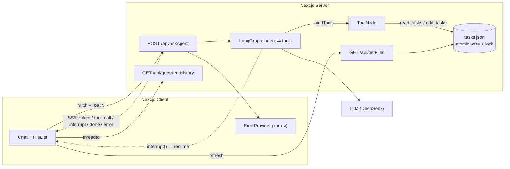

<div align="center">

# 🤖 Todo Agent

**LLM-агент, который сам читает и редактирует ваш список задач.**

Чат слева — живой список задач справа. Агент работает в цикле `agent → tools → agent`,
отдаёт ответ потоком по SSE и спрашивает подтверждение перед опасными действиями.

`Next.js 16` · `React 19` · `TypeScript (strict)` · `LangGraph` · `SSE` · `pino` · `zod`

</div>

---

## Что это

Пет-проект: одностраничное приложение, где вместо «формы для CRUD» вы разговариваете с агентом.

Вы пишете «закрой задачу про деплой и добавь задачу дописать тесты» — агент сам вызывает
нужные инструменты, меняет `tasks.json`, а UI обновляет список. Видно **как** он думает:
какой инструмент вызвал, с какими аргументами, и на каком шаге находится.

Задача проекта — разобраться руками в том, как устроен tool-calling агент:
граф состояний, стриминг, прерывания, валидация аргументов, обработка ошибок.

## ✨ Возможности

### 🤖 Агент
- **Tool-calling loop** на LangGraph: `StateGraph` с узлами `agent` / `tools` и условным переходом.
- **Стриминг ответа** по SSE — текст уходит в UI по мере генерации, а не одним куском в конце.
- **Показ шагов агента**: `token` → `tool_call` → `node_end` → `done`; в UI это «🤔 Думаю…» / «🔧 Работаю: edit_tasks…».
- **Human-in-the-loop**: удаление задачи уходит в `interrupt()` и выполняется только после подтверждения в модалке.
- **Учёт расхода**: количество вызовов LLM и токены копятся в state графа, пишутся в лог по завершении прогона.
- **Reasoning-блоки**: отдельное SSE-событие для «размышлений» модели, не смешивается с ответом.

### 💬 Интерфейс
- Две колонки: чат + список задач, который реально меняется от действий агента.
- Сообщение пользователя появляется в ленте **сразу** (оптимистичный рендер), без «дёрганья» и дублей.
- История диалога подтягивается из состояния графа после каждого завершённого стрима.
- Автоскролл, состояния загрузки / ошибки / пустоты, спиннер обновления, бейджи `Готово` / `В работе`.
- Тосты ошибок через `ErrorProvider` — единая точка показа ошибок на клиенте.

### 🧱 Инфраструктура
- **Валидация границ**: zod-схемы для аргументов инструментов и для файла задач (`safeParse` + читаемые issues).
- **Атомарная запись** файла: `tmp` + `rename`, плюс очередь-мьютекс, чтобы параллельные правки не терялись.
- **Единая модель ошибок**: `AppError` + `parseError`, различает `HTTP` / `NETWORK` / `ABORTED` / `STREAM` / `TIMEOUT`,
  отделяет `userMessage` (что показать) от `technicalMessage` (что писать в лог).
- **Структурные логи** на pino: JSON в проде, `pino-pretty` в dev; у каждого тула замеряется время и ловится ошибка.
- **Ленивая инициализация графа**: `appPromise`-синглтон, граф собирается один раз на процесс.

## 🏗 Архитектура



Поток одного запроса:

1. UI генерирует `threadId` (UUID) и шлёт `POST /api/askAgent`.
2. Роут валидирует body, лениво достаёт граф, запускает `app.stream(...)` в режимах `messages` + `updates`.
3. Чанки сообщений и апдейты узлов превращаются в SSE-события (`streamHandlers.ts`) и уезжают в `ReadableStream`.
4. Если модель запросила `delete_tasks`-подобную операцию с `interrupt()` — стрим отдаёт `interrupt`, UI показывает модалку
   и при `resume` шлёт `Command({ resume })` тем же роутом.
5. По завершении роут читает финальный state, логирует время / вызовы / токены и шлёт `done` или `interrupt`.

## 🚀 Быстрый старт

```bash
git clone <repo-url>
cd my-ai-agent
npm install

cp .env.example .env    # затем впишите свои ключи
npm run dev
```

Откройте <http://localhost:3000> → «Агент».

### Переменные окружения

| Переменная | Обязательна | По умолчанию | Назначение |
| --- | --- | --- | --- |
| `LANGGRAPH_MODEL_PROVIDER` | ✅ | `ollama` | Провайдер модели. **Сейчас поддерживается только `deepseek`** |
| `DEEPSEEK_API_KEY` | ✅ | — | Ключ DeepSeek |
| `DEEPSEEK_CHAT_MODEL` | ✅ | — | Имя модели, например `deepseek-chat` |
| `TASKS_FILE` | — | `public/Agent-task/tasks.json` | Путь к файлу задач |
| `LOG_LEVEL` | — | `info` | Уровень логирования pino |

> ⚠️ Провайдер `ollama` в коде закомментирован, а дефолт в `getModel.ts` — `ollama`.
> Поэтому переменную `LANGGRAPH_MODEL_PROVIDER=deepseek` нужно выставить явно.

### Скрипты

| Команда | Что делает |
| --- | --- |
| `npm run dev` | Дев-сервер |
| `npm run build` | Продакшн-сборка |
| `npm run start` | Запуск собранного приложения |
| `npm run lint` | ESLint (`eslint-config-next`) |

## 🧩 Инструменты агента

| Инструмент | Аргументы | Что делает |
| --- | --- | --- |
| `read_tasks` | — | Читает файл задач и возвращает JSON целиком |
| `edit_tasks` | ровно одно из: `upsert` \| `deleteId` \| `patch` | Добавляет/заменяет задачу по `id`, удаляет по `id` или патчит `status` / `comment` |

Схема `edit_tasks` требует **ровно одну** операцию за вызов (проверяется через `zod.refine`),
а `deleteId` дополнительно проходит через HITL-подтверждение.

## 📡 API

| Метод | Путь | Описание |
| --- | --- | --- |
| `POST` | `/api/askAgent` | Основной эндпоинт. Тело: `{ threadId, message }` или `{ threadId, resume }`. Отвечает `text/event-stream` |
| `GET` | `/api/getAgentHistory?threadId=…` | История диалога из состояния графа (только `human` / `ai` с непустым текстом) |
| `GET` | `/api/getFiles` | Текущий список задач (`Cache-Control: no-store`) |

### SSE-события

| `type` | Поля | Когда приходит |
| --- | --- | --- |
| `token` | `content` | Очередной кусок текста ответа |
| `reasoning` | `content` | Блок «размышлений» модели |
| `tool_call` | `node`, `tool`, `args` | Модель запросила инструмент |
| `node_end` | `node` | Узел графа завершил шаг |
| `interrupt` | `interrupt` | Нужно подтверждение пользователя |
| `done` | `message` | Прогон завершён |
| `error` | `error` (код), `message` | Ошибка прогона |

## 📁 Структура

```
app/                      # Next.js App Router
  agent/page.tsx          # страница: чат + список задач (RSC префетч задач)
  api/askAgent/route.ts   # основной стриминговый эндпоинт
  providers.tsx           # ErrorProvider + тосты
src/
  agent/
    buildApp.ts           # сборка StateGraph + инструменты
    getModel.ts           # фабрика модели по провайдеру
    streamHandlers.ts     # SSE-события + разбор тела запроса
    nodes/agentNode.ts    # узел агента: вызов LLM, usage, логи
    graph/helpers/agentState.ts  # Annotation-схема состояния
    mcpServers/fileSystem/jsonStore.ts  # чтение/атомарная запись файла задач
  features/               # Chat и FileList
  servers/hooks/          # useAsk, useAgentHistory, useTasks
  lib/                    # error.ts (AppError/parseError), sse.ts
  logger/logger.ts        # pino
  types/                  # Task (zod), SSEEvent
```

## 🗺 Roadmap

- [ ] Долговременная память: заменить in-memory чекпоинтер на SQLite/Postgres + список сессий в UI
- [ ] Лимиты на работу агента: таймаут на запрос и на шаг, лимит вызовов LLM, аккуратная остановка
- [ ] Структурное логирование: токены, стоимость, `session_id`, срабатывание лимитов, метрики
- [ ] Тесты: юнит на инструменты и обработку ошибок, интеграционный на SSE-стрим (включая обрыв)
- [ ] Системный промпт для агента (`src/agent/prompts` пока пустой)
- [ ] Фильтрация задач по статусу в UI
- [ ] Подключить MCP по-настоящему (сейчас `mcpServers/` — заготовка) или удалить папку
- [ ] Вынести стор задач из `public/` и подготовить проект к деплою

## ⚠️ Известные ограничения

- **История живёт в памяти процесса** (`MemorySaver`): после рестарта сервера диалог теряется,
  а на нескольких инстансах история будет «плавать». `threadId` генерируется на клиенте при каждой загрузке.
- **Задачи хранятся в `public/Agent-task/tasks.json`**: файл доступен по HTTP и он же используется как БД.
  Для serverless-деплоя (read-only FS) не подходит.
- **Нет ограничений на длину прогона** — агент может долго крутиться в цикле.
- **Нет тестов** — всё проверялось вручную.
- **MCP не подключён**: в `src/agent/mcpServers/` лежит заготовка клиента, инструменты при этом создаются напрямую.

## 📄 Лицензия

Лицензия пока не выбрана. Если планируете открывать код — добавьте `LICENSE`
(обычно достаточно MIT).
